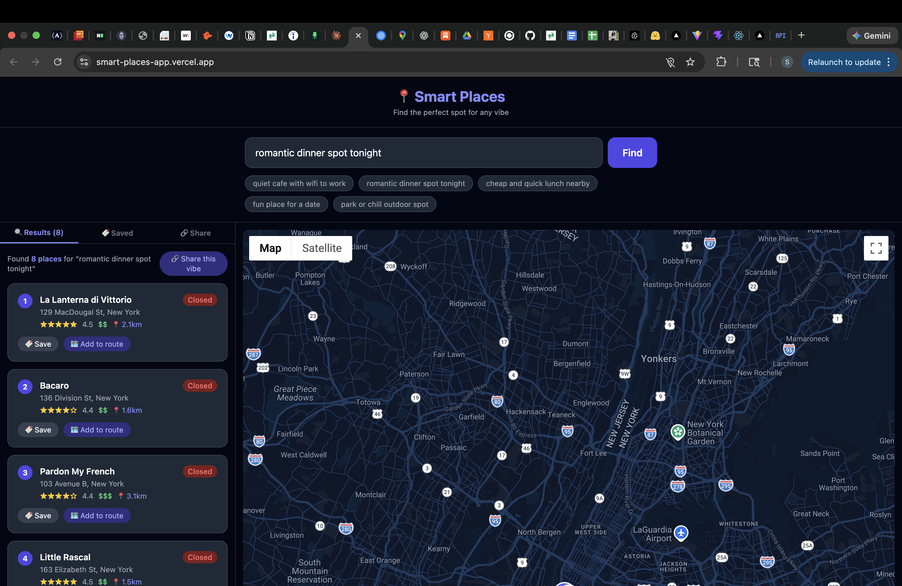
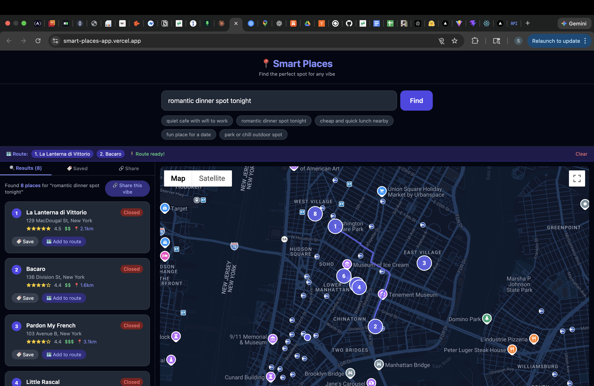
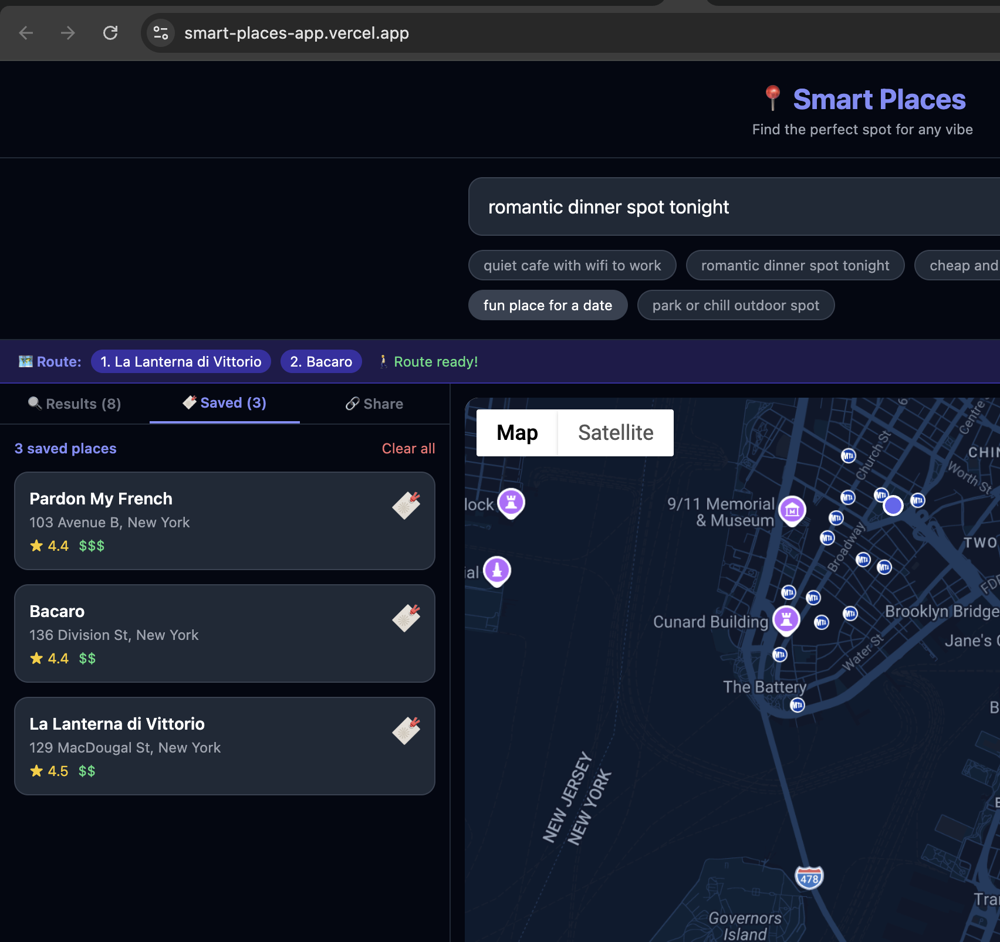
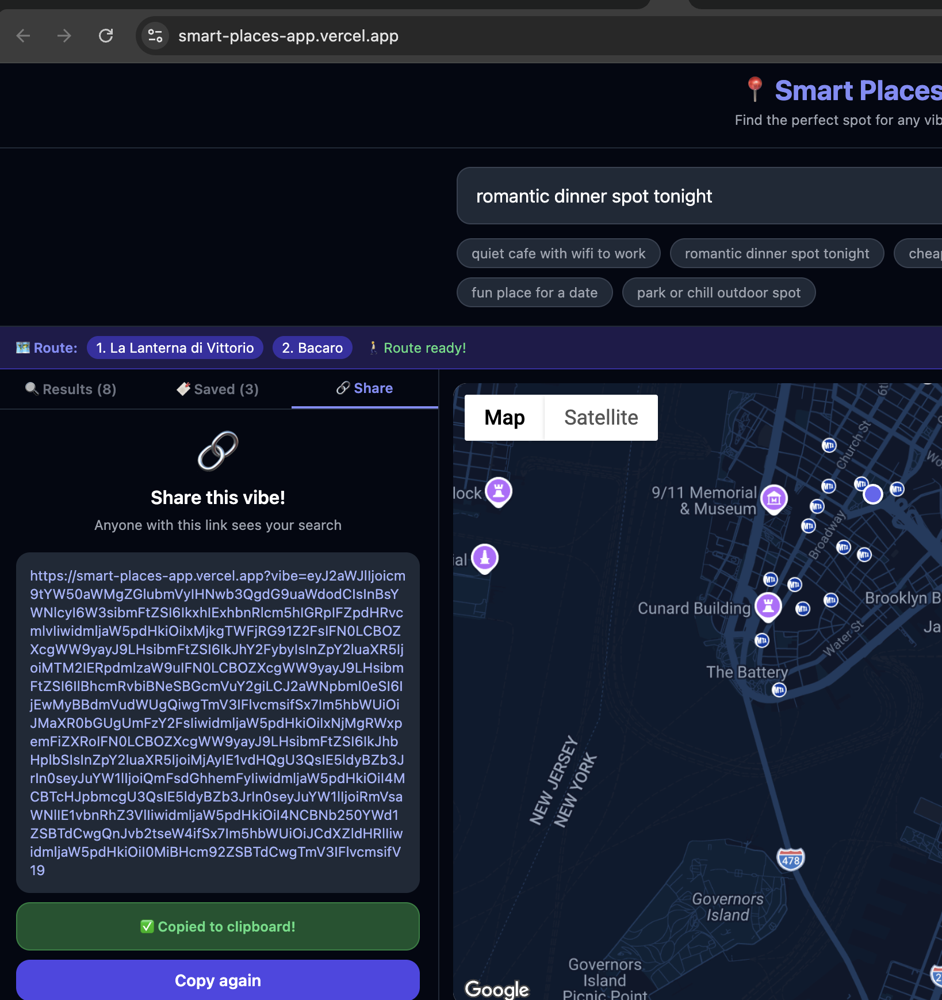

# Smart Places : Find the Perfect Spot for Any Vibe

A smart, AI-powered nearby places recommender that understands natural language. Just describe what you're looking for and Smart Places finds the best spots near you — with real-time ratings, distance, open/closed status, walking route planning, and shareable links.

**🌐 Live Demo:** [smart-places-app.vercel.app](https://smart-places-app.vercel.app)

---


---

## Features

### Vibe-Based Search
Type naturally — *"quiet cafe with wifi to work"* or *"cheap and quick lunch nearby"* - and the app intelligently maps your intent to real search filters. No dropdowns, no categories, just natural language.

### Interactive Dark Map
A beautifully styled dark map powered by Google Maps JavaScript API shows your location and numbered markers for every result. Results update live as you search.

### Real Nearby Places
Powered by Google Places API, every result includes real-world data : star ratings, price level, walking distance, address, and live open/closed status.



### Smart Route Planning
Add multiple places to a route and the app draws an optimized walking path between all stops using Google Directions API perfect for planning a full evening out.



### Save & History
Save favorite spots with one click. All saved places persist across sessions using local Storage no account or backend needed.



### Share a Vibe
Generate a shareable link for any search. Anyone who opens the link sees the same vibe and results great for sending friends *"here's our date night route."*



---

## Tech Stack

| Layer | Technology |
|---|---|
| Frontend | React + Vite |
| Styling | Tailwind CSS |
| Map | Google Maps JavaScript API |
| Places | Google Places API |
| Routing | Google Directions API |
| Distance | Haversine formula (custom) |
| Persistence | localStorage |
| Deployment | Vercel |

---

## Getting Started

### Prerequisites
- Node.js 18+
- A Google Cloud account with billing enabled
- Google Maps JavaScript API, Places API, and Directions API enabled

### Installation

```bash
# Clone the repo
git clone https://github.com/Sakshi3027/smart-places-app.git
cd smart-places-app

# Install dependencies
npm install
```

### Environment Variables

Create a `.env` file in the root directory:

```env
VITE_GOOGLE_MAPS_KEY=your_google_maps_api_key_here
```

### Running Locally

```bash
npm run dev
```

Open [http://localhost:5174](http://localhost:5174) in your browser.

---

## Project Structure

```
src/
  components/
    SearchBar.jsx       # Vibe input + quick suggestions
    MapView.jsx         # Google Map + markers + route rendering
    PlaceCard.jsx       # Result cards with save/route actions
    SavedPanel.jsx      # Saved places panel
  hooks/
    useVibe.js          # Natural language → search filters parser
    usePlaces.js        # Google Places API integration
  utils/
    loadGoogleMaps.js   # Dynamic Google Maps script loader
    haversine.js        # Distance calculation between coordinates
  App.jsx               # Main app with tabs and state management
```

---

## Google Cloud Setup

1. Go to [console.cloud.google.com](https://console.cloud.google.com)
2. Create a new project
3. Enable these APIs under **APIs & Services → Library**:
   - Maps JavaScript API
   - Places API
   - Places API (New)
   - Directions API
4. Create an API key under **Credentials**
5. Add your deployed URL to the key's HTTP referrer restrictions

---

## Deployment

This app is deployed on Vercel. To deploy your own:

```bash
npm install -g vercel
vercel
vercel env add VITE_GOOGLE_MAPS_KEY
vercel --prod
```

---

## How Vibe Parsing Works

The app uses a smart keyword-matching engine in `useVibe.js` to parse natural language into structured API filters:

```
"quiet cafe with wifi to work"
→ { type: "cafe", keyword: "wifi", maxPrice: 3, openNow: false }

"cheap and quick lunch nearby"
→ { type: "restaurant", keyword: "fast", maxPrice: 1, openNow: false }

"open bar near me right now"
→ { type: "bar", maxPrice: 3, openNow: true }
```

This can be swapped with a real AI API (Claude or OpenAI) for even smarter parsing.

---

## Screenshots

| Feature | Preview |
|---|---|
| Hero / Search |  |
| Results + Map |  |
| Route Planning |  |
| Saved Places |  |
| Share a Vibe |  |

---

## Author

**Sakshi Chavan**
- GitHub: [@Sakshi3027](https://github.com/Sakshi3027)
- Project: [smart-places-app.vercel.app](https://smart-places-app.vercel.app)

---

## License

MIT License — free to use and modify.